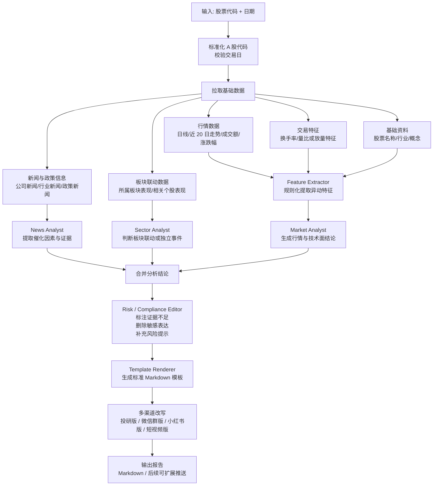

# A 股 Agent MVP 产品化计划

## 当前阶段

当前项目已经完成 A 股 Agent 的基础跑通：

- TuShare Pro 用于 A 股行情、复权行情、财务数据。
- AkShare 用于新闻和部分市场资讯 fallback。
- DeepSeek 用于 LLM 推理。
- CLI 可以通过源码方式运行。
- A 股 ticker 使用 TuShare 格式，例如 `600326.SH`、`000563.SZ`。

下一阶段目标不是继续堆数据源，而是把现有能力包装成一个可以稳定交付、快速验证市场需求的 MVP 产品。

# MVP 方案：A 股盘后复盘与异动归因助手

## 1. 产品形态

### 1.1 产品定位

**A 股盘后复盘与异动归因助手**

面向财经创作者、投资社群主、投教老师和小型投研团队，自动整理 A 股行情、新闻、板块变化，并生成可直接发布的复盘内容。

### 1.2 目标用户

- 财经博主
- 投资社群主
- 知识星球主
- 短视频财经号
- 投教老师
- 小型投研团队
- 财经内容运营人员

### 1.3 MVP 核心功能

#### 功能一：单股异动分析

**输入：**

```text
股票代码 + 日期
```

**示例：**

```text
300750.SZ
2026-05-27
```

**输出：**

```text
1. 今日表现
2. 可能异动原因
3. 新闻/政策证据
4. 技术面位置
5. 板块联动
6. 风险提示
7. 社群短版
8. 小红书/短视频版
```

---

#### 功能二：盘后热点复盘

**输入：**

```text
交易日期
```

**输出：**

```text
1. 今日市场概览
2. 热点板块 Top 5
3. 资金活跃方向
4. 涨幅居前个股归因
5. 跌幅居前个股风险
6. 重要新闻
7. 明日观察点
8. 微信群版
9. 小红书版
10. 短视频口播版
```

---

### 1.4 产品边界

#### MVP 阶段做

```text
盘后复盘
单股异动归因
新闻证据整理
板块热点解释
多渠道内容生成
风险提示
```

#### MVP 阶段不做

```text
实时盘中提醒
公告正文解读产品
AI 荐股
涨停预测
自动交易
组合调仓
买卖点建议
目标价
仓位建议
收益率预测
准确率宣传
```

---

## 1.5 单股异动分析流程图



### 流程说明

```text
1. 先用程序化方式完成数据拉取和特征提取，尽量减少 LLM 在事实层的自由发挥。
2. Market Analyst、News Analyst、Sector Analyst 只负责各自结论，不直接输出最终成稿。
3. Risk / Compliance Editor 统一处理证据强弱、风险提示和合规表达。
4. Template Renderer 负责把结构化结论拼成固定模板，保证输出稳定。
5. 多渠道改写放在最后一步，避免前置文风改写污染事实判断。
```

---

## 2. 改造方案

### 2.1 A 股版 Agent 角色设计

#### 1. Market Analyst

负责市场、行情和技术表现分析。

**输入：**

```text
指数涨跌
个股涨跌
成交额
换手率
近 20 日走势
板块表现
```

**输出：**

```text
今日市场表现
是否放量
是否明显异动
是否强于板块/指数
技术面位置
```

---

#### 2. News Analyst

负责新闻和政策信息分析。

**输入：**

```text
财经新闻
行业新闻
政策新闻
```

**输出：**

```text
新闻摘要
可能催化因素
信息可信度
是否有权威来源
```

---

#### 3. Sector Analyst

负责板块和题材分析。

**输入：**

```text
所属行业
所属概念
板块涨跌幅
板块相关新闻
相关个股表现
```

**输出：**

```text
是否是板块联动
是否属于当日主线
是个股独立事件还是题材共振
相关板块风险
```

---

#### 4. Risk Analyst

负责风险提示和合规审查。

**输入：**

```text
Market Analyst 结论
News Analyst 结论
Sector Analyst 结论
```

**输出：**

```text
证据不足的结论
传闻类信息标注
风险点
不确定性
合规表达修正
```

**合规过滤内容：**

```text
买入
卖出
强烈推荐
目标价
必涨
涨停预测
仓位建议
止损位
收益率承诺
准确率宣传
跟单
喊单
```

---

#### 5. Content Editor

负责内容生成和多渠道改写。

**输入：**

```text
Market Analyst 结论
News Analyst 结论
Sector Analyst 结论
Risk Analyst 结论
```

**输出：**

```text
投研版
微信群版
小红书版
公众号版
短视频口播版
```

---

### 2.2 暂时关闭或弱化的 Agent

```text
Trader
Portfolio Manager
Aggressive Bull Researcher
Aggressive Bear Researcher
Risky Debator
Safe Debator
Neutral Debator
Trade Decision Agent
```

---

### 2.3 数据接入范围

#### 单股异动分析所需数据

```text
个股当日行情
个股近 20 日行情
成交额
换手率
涨跌幅
所属行业
所属概念
当日相关新闻
板块表现
```

#### 盘后复盘所需数据

```text
指数表现
市场成交额
涨幅榜
跌幅榜
成交额榜
热点板块
涨停个股
重要新闻
```

---

### 2.4 标准输出模板

#### 单股异动分析模板

```md
# {股票名称}（{股票代码}）今日异动解读

## 1. 今日表现

- 涨跌幅：
- 成交额：
- 换手率：
- 相对行业表现：
- 近 20 日位置：

## 2. 可能原因

- 原因一：
- 原因二：
- 原因三：

## 3. 公开信息依据

- 新闻：
- 行业/政策：
- 板块联动：

## 4. 技术与资金表现

- 成交量：
- 均线位置：
- 是否放量：
- 是否突破/回落：

## 5. 风险与不确定性

- 风险一：
- 风险二：
- 信息不确定性：

## 6. 社群短版

适合微信群/知识星球发布。

## 7. 小红书/短视频版

适合口播或图文发布。

> 本内容基于公开资料自动整理，仅供信息参考，不构成投资建议。
```

---

#### 盘后复盘模板

```md
# A 股盘后复盘：{date}

## 1. 今日市场概览

- 上证指数：
- 深证成指：
- 创业板指：
- 成交额：
- 市场情绪：

## 2. 今日热点板块

1. 板块 A：原因
2. 板块 B：原因
3. 板块 C：原因

## 3. 异动个股

| 股票 | 涨跌幅 | 所属板块 | 可能原因 | 风险 |
|---|---:|---|---|---|

## 4. 重要新闻

- 新闻一：

## 5. 明日观察

- 观察点一：
- 观察点二：
- 风险事件：

## 6. 微信群版

## 7. 小红书版

## 8. 短视频口播版

> 本内容基于公开资料自动整理，仅供信息参考，不构成投资建议。
```

---

### 2.5 改造优先级

#### Phase 1：单股异动分析

```text
输入股票代码 + 日期
拉取行情、新闻、板块数据
生成单股异动分析报告
输出 Markdown
```

#### Phase 2：盘后热点复盘

```text
输入交易日期
拉取指数、板块、涨跌幅榜、新闻
生成盘后复盘
输出多渠道版本
```

#### Phase 3：多渠道内容生成与合规过滤

```text
统一投研版输出
生成微信群版、小红书版、短视频口播版
增加敏感表达过滤和风险提示修正
```

#### Phase 4：定时任务与推送

```text
每日自动生成盘后复盘
推送到飞书、企业微信、邮箱或 Markdown 文件
```

---

## 3. 交互形态

### 3.1 版本 0：命令行 + Markdown 输出

适合内部测试和快速验证。

#### 推荐运行方式

```text
优先通过源码方式运行 CLI：
python -m cli.main ...

不要直接运行项目根目录下的 main.py。
根目录 main.py 是示例脚本，默认走原始 TradingAgents 图谱，不会进入 A 股 MVP 的单股异动分析流程。
```

#### 单股异动分析

```bash
conda run -n tradingagents python -m cli.main ashare stock-move --symbol 300750.SZ --date 2026-05-27
```

#### 盘后复盘

```bash
conda run -n tradingagents python -m cli.main ashare daily-review --date 2026-05-27
```

#### 带工作区缓存目录的推荐命令

```bash
TRADINGAGENTS_CACHE_DIR=/Users/luka/Desktop/personal/TradingAgents_A/.tradingagents-cache \
conda run -n tradingagents python -m cli.main ashare stock-move \
  --symbol 300750.SZ \
  --date 2026-05-27 \
  --output reports/stock/300750_2026-05-27.md \
  --no-print
```

#### 为什么不建议直接运行 python main.py

```text
根目录 main.py 目前是项目示例脚本，
默认运行的是原始 TradingAgentsGraph，
并且示例里写死了美股 ticker 和日期。

因此：
- python main.py 不会进入 A 股 MVP 的 stock-move 命令
- 也不会读取 --symbol、--date、--output 这类参数
```

#### 输出目录

```text
reports/
  stock/
    300750_2026-05-27.md
  daily_review/
    ashare_daily_review_2026-05-27.md
```

---

### 3.2 版本 1：Streamlit / Gradio 小工具

适合演示和给潜在客户试用。

#### 页面入口

```text
单股异动分析
盘后热点复盘
```

#### 表单字段

##### 单股异动分析

```text
股票代码
日期
输出风格：投研版 / 微信群版 / 小红书版 / 短视频版 / 全部
```

##### 盘后热点复盘

```text
交易日期
热点板块数量
异动个股数量
输出风格：投研版 / 微信群版 / 小红书版 / 短视频版 / 全部
```

#### 页面操作

```text
生成报告
复制内容
下载 Markdown
导出 PDF，可选
```

---

### 3.3 版本 2：定时日报推送

适合收费交付。

#### 定时任务

```text
15:30 生成 A 股收盘复盘
08:30 生成早间观察，可选
```

#### 推送渠道

```text
飞书
企业微信
邮箱
微信群文本
Notion
Markdown 文件
PDF 文件
```

#### 交付内容

```text
每日盘后复盘
每日热点板块
每日异动个股归因
每日重要新闻
多渠道内容版本
```

---

### 3.4 推荐 MVP 交互路径

#### 第一阶段

```text
命令行运行
Markdown 输出
人工检查报告质量
人工发给测试用户
```

#### 第二阶段

```text
Streamlit / Gradio 页面
用户自行输入股票或日期
用户复制/下载内容
```

#### 第三阶段

```text
定时任务生成日报
自动推送给付费用户
支持自选股和自定义输出风格
```

---

## 4. 当前实现状态

### 4.1 已完成

```text
已新增 A 股 MVP 独立代码路径，不复用原始交易决策图谱。
已实现单股异动分析第一版骨架。
已实现盘后热点复盘第一版骨架。
已新增独立 CLI 入口：ashare stock-move / ashare daily-review。
已实现基础 Markdown 模板输出。
已接入行业板块数据，用于热点板块排行和个股板块联动。
已实现盘后复盘中的逐股归因增强。
已补基础测试，并在 conda 环境 tradingagents 中通过。
```

#### 当前已落地模块

```text
tradingagents/ashare_mvp/
  schemas.py
  data/board_data.py
  data/stock_move.py
  data/daily_review.py
  feature_extractor.py
  daily_review_features.py
  analysis.py
  compliance.py
  renderers.py
  pipeline/stock_move_pipeline.py
  pipeline/daily_review_pipeline.py

cli/ashare_mvp.py
tests/test_ashare_board_data.py
tests/test_ashare_mvp_daily_review.py
tests/test_ashare_mvp_stock_move.py
```

#### 当前实现能力

```text
输入股票代码 + 日期
拉取近 20 日附近行情、公司基础资料、新闻证据
提取量价和位置特征
生成 Market / News / Sector / Compliance 四段轻量分析
渲染成固定 Markdown 报告
支持保存到 reports/ 目录

输入交易日期
拉取指数、市场成交额、涨跌幅榜、成交额榜、重要新闻
优先使用行业板块真实排行生成热点板块
生成盘后复盘 Markdown 报告
对涨跌幅居前个股生成规则化归因与风险提示
```

### 4.2 当前限制

```text
行业板块已接入，但概念板块仍未接入正式链路。
真实运行依赖可用的 TuShare Token 或 AkShare 网络访问。
如果 LLM 不可用，当前会自动退回规则化分析。
盘后热点复盘当前是第一版，更多依赖规则归因而非深度多角色分析。
公告正文解读仍不在 MVP 范围内。
```

### 4.3 下一步待实现

```text
1. 跑通真实 stock-move 报告并打磨输出质量
2. 补概念板块数据接口
3. 增强合规过滤与风险提示
4. 增强盘后复盘里的热点主线解释和逐股归因质量
5. 视情况增加批量运行和定时推送
```

### 4.4 概念板块数据接口 TODO

```text
目标：
把当前以行业板块为主的热点主线判断，升级为“行业板块 + 概念板块”双层结构。
```

#### 需要接入的接口

```text
AkShare:
- stock_board_concept_name_em
- stock_board_concept_hist_em
- stock_board_concept_cons_em
```

#### 计划实现内容

```text
1. 新增 concept board fetcher
  获取概念板块名称、当日涨跌幅、板块代码

2. 新增 concept constituents fetcher
  获取概念板块成分股

3. daily-review 接入概念板块
  在热点板块列表中同时展示行业主线和概念主线

4. stock-move 接入概念板块
  除所属行业外，补充可能相关的概念板块联动说明

5. 主线解释增强
  区分“行业驱动”“概念驱动”“行业+概念共振”
```

#### 当前暂未做的原因

```text
概念板块和个股映射会比行业板块更复杂，
需要额外处理板块数量多、命名不稳定、成分股重叠高的问题。

因此当前版本先把行业板块链路跑稳，
再补概念板块，以避免在 MVP 初期引入过多噪音。
```

## Forward Test 实现思路

当前框架不适合直接做严格历史回测。原因是新闻、搜索结果、部分财务数据和 LLM 输出都不具备严格的 point-in-time 保证。

更适合的验证方式是：

```text
每日固定时间运行 Agent，保存当时的数据、报告和交易观点，然后在未来 N 个交易日后评估表现。
```

这属于 forward test / paper trading，比“今天回头跑历史日期”更接近真实使用场景。

### 为什么不建议直接历史回测

主要问题：

1. 新闻数据不可靠
  新闻接口和搜索接口通常返回的是当前可搜索到的内容。即使传入历史日期，也很难保证结果等同于历史当天用户能看到的信息。
2. 财务数据可能有未来函数
  如果只按报告期过滤，而不按公告发布时间过滤，就可能在历史日期看到当时还没披露的数据。
3. LLM 输出不可完全复现
  模型版本、提示词、API 行为、搜索结果排序都可能变化。今天运行 2025 年某天的分析，不等于当时真实可获得的判断。
4. 数据源会修订历史数据
  财务、行情、指数成分、新闻链接都可能在后续被修订或下线。

因此，当前阶段建议把它定义为：

```text
前向纸面交易验证系统
```

而不是：

```text
严格历史回测系统
```

### Forward Test 工作流

每日流程：

```text
1. 读取 watchlist.csv
2. 对每只股票运行 Agent
3. 保存原始数据快照
4. 保存完整报告
5. 保存结构化 signal
6. 记录运行日志和失败项
7. 在未来 1/3/5/10/20 个交易日后计算表现
```

建议运行时间：

```text
A 股收盘后，例如 16:00-18:00
```

这样可以确保当天收盘行情、新闻和公告数据相对完整。

### 需要保存的数据

每次运行至少保存：

```text
输入：
- symbol
- name
- analysis_date
- watchlist 来源

行情：
- 当日收盘价
- 成交量
- 近 N 日 OHLCV
- 基准指数收盘价

Agent 输出：
- rating
- final_decision
- risk_summary
- key_catalysts
- key_risks
- report_path

运行信息：
- data_sources
- missing_data
- model
- prompt_version
- code_commit
- duration_seconds
- status
```

示例 signal：

```json
{
  "date": "2026-05-27",
  "symbol": "600326.SH",
  "name": "西藏天路",
  "rating": "Overweight",
  "close": 8.23,
  "benchmark": "000300.SH",
  "benchmark_close": 3920.15,
  "final_decision": "维持谨慎偏多，关注量能和建材板块持续性。",
  "key_catalysts": [
    "建筑材料板块资金流入",
    "区域基建预期升温"
  ],
  "key_risks": [
    "短期涨幅过快",
    "量能持续性不足"
  ],
  "data_sources": {
    "price": "tushare_pro",
    "fundamentals": "tushare_pro",
    "news": "akshare"
  },
  "missing_data": [
    "tavily_news"
  ],
  "llm_provider": "deepseek",
  "quick_model": "deepseek-v4-flash",
  "deep_model": "deepseek-v4-pro",
  "prompt_version": "a-share-mvp-v1",
  "report_path": "reports/2026-05-27/600326.SH.md",
  "status": "success"
}
```

### 推荐目录结构

```text
forward_test/
  watchlists/
    default.csv
  reports/
    2026-05-27/
      daily_digest.md
      600326.SH.md
      000563.SZ.md
  snapshots/
    2026-05-27/
      600326.SH/
        prices.parquet
        fundamentals.json
        news.jsonl
        prompt.txt
        final_state.json
  signals.sqlite
  performance/
    daily_performance.csv
    rating_performance.csv
    symbol_performance.csv
  run_summary/
    2026-05-27.json
```

### signals.sqlite 表设计

建议先用 SQLite。

`signals` 表：

```sql
CREATE TABLE signals (
    id INTEGER PRIMARY KEY AUTOINCREMENT,
    date TEXT NOT NULL,
    symbol TEXT NOT NULL,
    name TEXT,
    rating TEXT NOT NULL,
    close REAL,
    benchmark TEXT,
    benchmark_close REAL,
    final_decision TEXT,
    report_path TEXT,
    prompt_version TEXT,
    code_commit TEXT,
    llm_provider TEXT,
    quick_model TEXT,
    deep_model TEXT,
    status TEXT NOT NULL,
    created_at TEXT NOT NULL
);
```

`signal_returns` 表：

```sql
CREATE TABLE signal_returns (
    signal_id INTEGER NOT NULL,
    horizon_days INTEGER NOT NULL,
    future_date TEXT,
    future_close REAL,
    raw_return REAL,
    benchmark_return REAL,
    alpha_return REAL,
    max_drawdown REAL,
    calculated_at TEXT NOT NULL,
    PRIMARY KEY (signal_id, horizon_days)
);
```

`run_logs` 表：

```sql
CREATE TABLE run_logs (
    id INTEGER PRIMARY KEY AUTOINCREMENT,
    run_date TEXT NOT NULL,
    symbol TEXT,
    status TEXT NOT NULL,
    error_message TEXT,
    duration_seconds REAL,
    data_sources TEXT,
    missing_data TEXT,
    created_at TEXT NOT NULL
);
```

### 评估周期

建议先评估这些周期：

```text
1 个交易日
3 个交易日
5 个交易日
10 个交易日
20 个交易日
```

计算指标：

```text
raw_return = future_close / close - 1
benchmark_return = future_benchmark_close / benchmark_close - 1
alpha_return = raw_return - benchmark_return
```

按 rating 统计：

```text
Buy 平均收益
Overweight 平均收益
Hold 平均收益
Underweight 平均收益
Sell 平均收益
胜率
平均 alpha
最大回撤
样本数
```

### 评级和收益方向

不同 rating 的预期方向：

```text
Buy:
  期望 raw_return 和 alpha_return 明显为正

Overweight:
  期望 alpha_return 为正

Hold:
  期望波动较小，收益接近基准

Underweight:
  期望 alpha_return 为负，或者弱于基准

Sell:
  期望 raw_return 或 alpha_return 为负
```

注意：第一阶段不要过度追求单笔准确率，更重要的是看统计分布。

### Forward Test Runner

建议新增命令：

```bash
python -m scripts.forward_test_run --watchlist forward_test/watchlists/default.csv --date 2026-05-27
```

职责：

```text
1. 读取 watchlist
2. 对每只股票运行 Agent
3. 生成报告
4. 写入 signals.sqlite
5. 保存数据快照
6. 生成 daily_digest.md
7. 生成 run_summary JSON
```

### Performance Updater

建议新增命令：

```bash
python -m scripts.forward_test_update_returns --date 2026-05-27
```

职责：

```text
1. 找出 signals 表里尚未计算收益的记录
2. 检查是否已经到达 1/3/5/10/20 个交易日
3. 拉取未来价格和基准价格
4. 写入 signal_returns 表
5. 更新 performance CSV
```

### Forward Test Dashboard

后续可以做一个简单页面展示：

```text
总样本数
按 rating 的平均收益
按 horizon 的 alpha
最近一周表现
最好/最差信号
失败运行记录
```

第一版可以先用 Markdown 或 CSV，不必马上做 Web UI。

### 与 MVP 的关系

Forward test 是产品可信度建设的一部分。

它可以回答：

```text
这个 Agent 的评级有没有统计价值？
哪些行业表现更好？
哪些 rating 更可靠？
新闻驱动的结论是否有效？
技术面驱动的结论是否更短期有效？
```

它也可以作为产品展示材料：

```text
过去 30 天，Overweight 信号 5 日平均 alpha 为 X%
过去 30 天，风险上升标签股票平均跑输基准 Y%
```

但在样本量不足前，不要把这些指标当成收益承诺。

### Forward Test MVP 开发顺序

建议顺序：

```text
1. signals.sqlite
2. 结构化 signal 提取
3. 每日报告保存
4. run_summary.json
5. 收益更新脚本
6. rating_performance.csv
7. daily_digest 中加入历史表现摘要
```

第一版目标：

```text
连续运行 20 个交易日，积累至少 200-500 条信号样本。
```

这比一次性历史回测更慢，但更真实、更可信，也更适合当前 Agent 架构。
